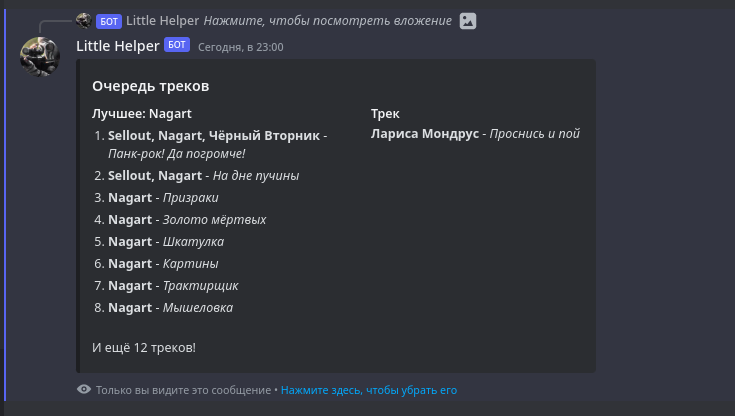
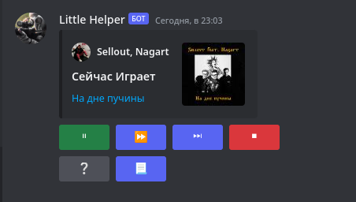

# Дискорд Бот для прослушивания Яндекс Музыки


Этот функционал проигрывания треков из Яндекс Музыки изначально был реальзован для бота [Little Helper](https://discord.com/api/oauth2/authorize?client_id=922426572953231420&permissions=8&scope=bot). Буду не против если вы добавите его к себе на сервер дискорд.

## Что умеет этот бот?
- Проигрывание Треков/Альбомов/Плейлистов/Подкастов/Аудиокниг из Яндекс.Музыки
- Формирование очереди из Треков/Альбомов/Плейлистов.

- Полноценный МедиПлеер.

    
- Пропуск как одного трека так и плейлиста.
- Остановка проигрывание и его возобновление с помощью медиаплеера.
- Отслеживание активности в голосовом чате.
    - Если в голосов канале нет никого кроме бота в течении 3-х минут он останавливает проигрывание и выходит из голосового чата.
- `Защита от дурака`
    - Если бота отключат не с помощью медиаплеера бот спокойно закончит проигрывание.
    - Интерактивные кнопки в медиаплеере доступны только тем пользователям которые в данный момент находятся в одном голосовом канале с ботом.
- Поиск Трека/Альбома/Плейлиста/Подкаста/Аудиокниги как с помощью прямой ссылки так и с помощью обычного запроса.


### Необходимые зависимости
Для работы бота вам необходим ffmpeg
Чтобы скачать его в linux(ubuntu):
```shell
 apt install ffmpeg
```
в Windows:
Вам необходимо скачать ffmpeg [здесь](https://ffmpeg.org/).
И в bot.music.event_loop.py на [этой строке](bot/music/event_loop.py#L72) указать путь до вашего ffmpeg:
```python
voiceManager.voiceClient.play(FFmpegOpusAudio(normalized_audio.export(format='wav'), pipe=True, executable="ffmpeg.exe"))
```

Также необходимо установить необходимые библиотеки:
```cmd
pip install -r req.txt
```

## Настройка
В [bot.py](bot/cfg.py) находятся токены Яндекс.Музыки и Дискорд Бота которые необходимы для запуска бота.

Вы можете как 
Заменить это:
```python
token = os.environ["discordBotToken"]
YMToken = os.environ["YMTOKEN"]
```
на это:
```python
token = "MyDiscordToken"
YMToken = "MyYMToken"
```
Также вы можете использовать токены из переменных сред как это изначально задумывалось.

О том как получить токен Яндекс.Музыки вы можете узнать [здесь](https://github.com/MarshalX/yandex-music-api/discussions/513).


## Запуск бота
```cmd
python main.py
```